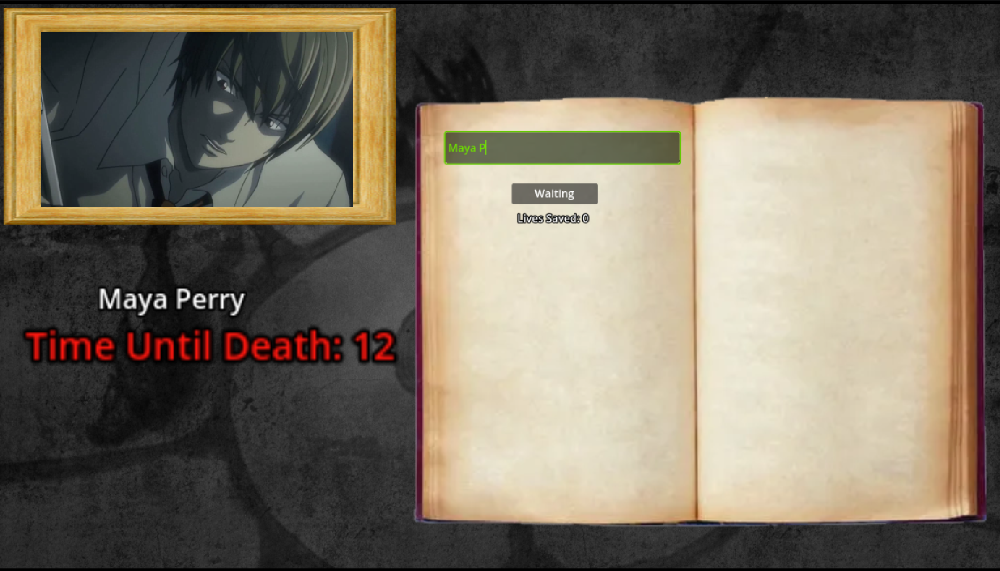
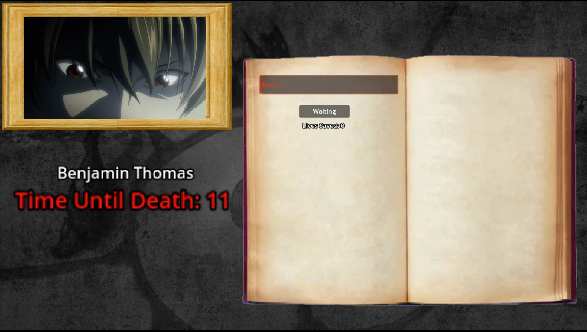
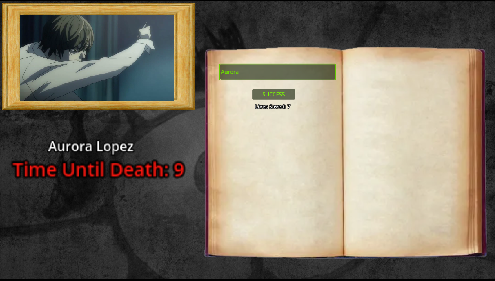
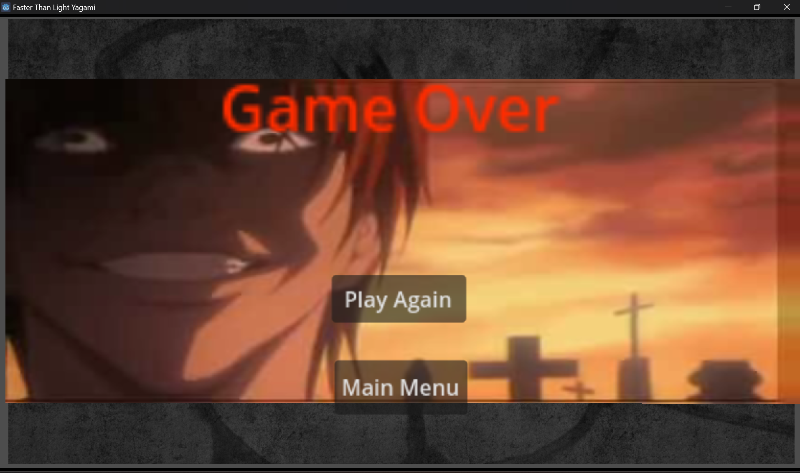

# FallHacks2024

Faster than light yagami. 1st Place Winner of FallHacks2024

## Inspiration

We were inspired by the popular japanese anime series called Death Note. Bryan created the idea of faster than light yagami which inspired our project.

## What it does

Faster Than Light Yagami is a Godot game that is like a speed typing game. You are trying to type faster than the time limit as the time limit shortens as you progress and the words get harder and longer. There is a leaderboard that (sometimes) works. The words are compared in realtime as you type which shows green if correct and shows red if wrong. It also has audio and video clips that enriches the game.

## How we built it

This is project is made from using Godot.

## Screenshots of the game

## Challenges we ran into

All problems we ran into were all based on github. Merging, pulling, pushing errors, and losing files/folders.

## Accomplishments that we're proud of

We are proud of our final product and the friendship we made along the way.

## What we learned

We learned to code in Godot, adding videos, audios, button, labels, timers and adding scripts to handle navigation, timers, display, choosing names, etc.

## What's next for Faster Than Light Yagami

Implementing the OCR API to draw letters instead of typing it and making sure the leaderboard works.
